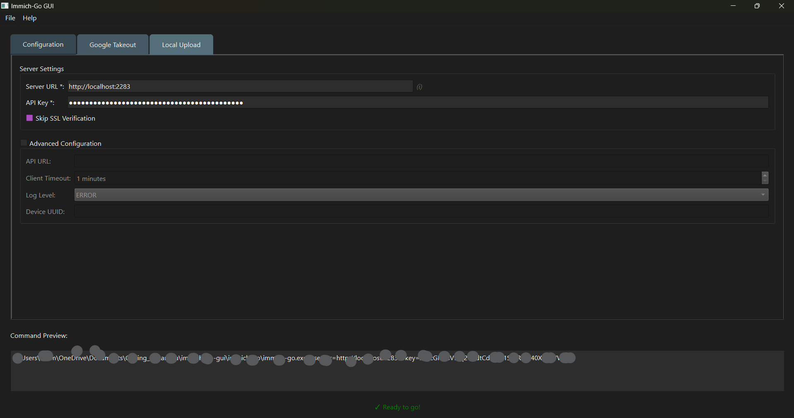

# Immich-Go GUI

[](https://opensource.org/licenses/MIT)
[](https://www.python.org/downloads/)

Immich-Go GUI is a graphical front-end for immich-go, a tool for managing media uploads to the Immich server. This GUI simplifies the process of configuring, launching, and monitoring immich-go.

[Immich](https://github.com/immich-app/immich) is a high-performance, self-hosted photo and video backup solution.




## Features

* Cross-platform terminal launching: Launches immich-go in a separate terminal window on Windows, macOS, and Linux.
* Process tracking and status indicators: Disables run buttons while immich-go is active and displays a prompt asking the user to close the terminal window before starting a new process.
* Command preview: Displays the constructed immich-go command with the selected configuration options.

## Requirements

* Python 3.6 or newer
* uv Package Manager
* Install uv by following the installation guide available at:
  https://docs.astral.sh/uv/getting-started/installation/

## Installation & Running

### 1. Clone the Repository
Navigate to your desired directory in a terminal and run:
```bash
git clone https://github.com/shitan198u/immich-go-gui.git
cd immich-go-gui
```

### 2. Run the Application with uv
In the project directory, execute:
```bash
uv run app.py
```

### 3. Download Immich-Go Binary
On the first run, the application creates a folder named "immich-go". Download the latest immich-go binary from the releases section at:
https://github.com/simulot/immich-go/releases/latest

Then, place the binary in the prompted "immich-go" folder. (On Linux/macOS, ensure the binary has execute permissions if required, for example by running:
```bash
chmod +x immich-go
```

## Immich-Go Integration

This GUI is designed to work with immich-go. For detailed usage instructions and advanced functionality, please visit the immich-go repository on GitHub:
https://github.com/simulot/immich-go/

## Contributing

Contributions are welcome! If you would like to contribute, please open an issue or submit a pull request.

## License

This project is licensed under the MIT License.
