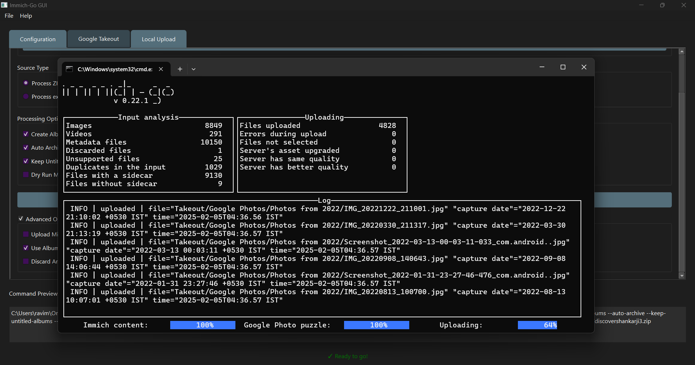
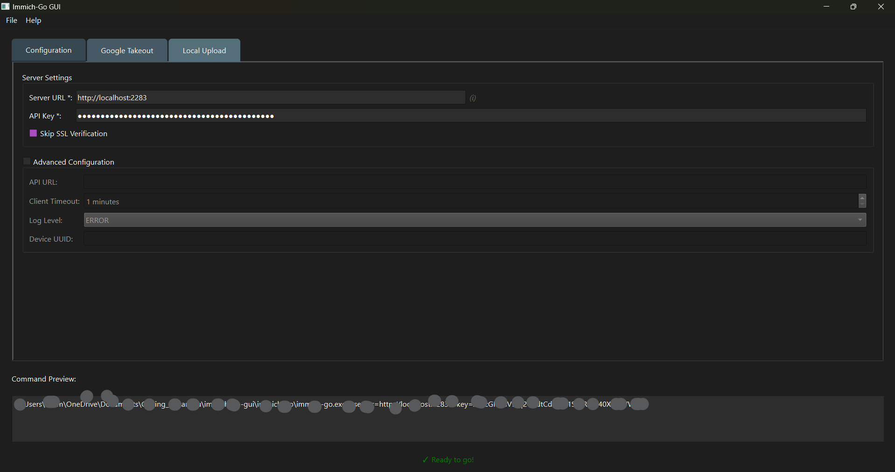

# Immich-Go GUI

[](https://opensource.org/licenses/MIT)
[](https://www.python.org/downloads/)

style>
  .warning {
    color: red;
    font-weight: bold;
    font-size: 1.2em;
  }
</style>

<div class="warning">
  ⚠️ **Important Notice:** Breaking changes have been introduced in `immich-go` versions v0.23 and above. Please use version v0.22.1 until a fix is posted.
</div

Immich-Go GUI is a graphical front-end for immich-go, a tool for managing media uploads to the Immich server. This GUI simplifies the process of configuring, launching, and monitoring immich-go.

[Immich](https://github.com/immich-app/immich) is a high-performance, self-hosted photo and video backup solution.




## Features

* **Cross-platform terminal launching**: Launches immich-go in a separate terminal window on Windows, macOS, and Linux.
* **Automatic binary download**: Fetches and installs the latest immich-go release for your system.
* **Process tracking and status indicators**: Disables run buttons while immich-go is active and displays a prompt asking the user to close the terminal window before starting a new process.
* **Command preview**: Displays the constructed immich-go command with the selected configuration options.
* **Google Takeout integration**: Supports uploading Google Takeout photos and videos to Immich.
* **Local folder uploads**: Select any local directory and filter files by date or extension before uploading.
* **Advanced settings**: Customize API URLs, logging levels, timeout durations, and other settings.
* **Configuration saving & loading**: Stores user preferences to streamline repeated usage.
* **Drag & Drop Support**: Easily add files and directories to the application for processing.

## Requirements

* Python 3.6 or newer
* uv Package Manager
* Install uv by following the installation guide available at:
  https://docs.astral.sh/uv/getting-started/installation/

## Installation & Running

### 1. Clone the Repository
Navigate to your desired directory in a terminal and run:
```bash
git clone https://github.com/shitan198u/immich-go-gui.git
cd immich-go-gui
```

### 2. Run the Application with uv
In the project directory, execute:
```bash
uv run app.py
```


## Immich-Go Integration

This GUI is designed to work with immich-go. For detailed usage instructions and advanced functionality, please visit the immich-go repository on GitHub:
https://github.com/simulot/immich-go/

## Contributing

Contributions are welcome! If you would like to contribute, please open an issue or submit a pull request.

## Support

If you find this project useful and would like to support its development, you can:

### **💖 GitHub Sponsors**

[](https://github.com/sponsors/shitan198u)

### **☕ Buy Me a Coffee**

[](https://www.buymeacoffee.com/shivashitan)

## License

This project is licensed under the MIT License.

